# Repository Module Atlas

## Trunk Summary

- Product/system name: RunThru
- App type: Flutter paced reading app for iOS, Android, desktop shells, and share/import workflows
- Primary stack: Dart/Flutter, Riverpod, go_router, pdfrx/pdfium, SharedPreferences, platform channels, Fastlane/GitHub Actions/Codemagic

RunThru is a Flutter app centered on paced reading, document ingestion, reading state, and a 3D/parallax reading UI. The older shared layers live in `lib/core`, `lib/services`, `lib/screens`, `lib/widgets`, and `lib/three_d`, while newer feature-oriented code lives under `lib/features/content`, `lib/features/reading`, and `lib/features/settings`. State is mostly Riverpod-based, with generated Riverpod providers in feature folders and hand-written providers in older service/core layers. Platform folders provide Flutter shells plus custom Android/iOS file access and share-intent handling. Docs, prompts, and release metadata are first-class project artifacts and reflect an ongoing rebrand from Speedy Boy to RunThru.

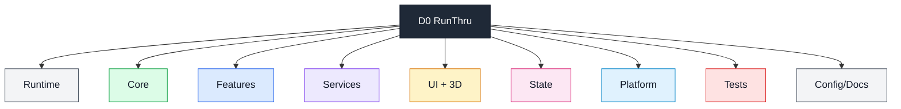

## Diagram Index

| Diagram ID | Title | Scope | Connects To |
|---|---|---|---|
| D0-Trunk | Product overview | Whole repo | all diagrams |
| D1-App-Runtime | App startup/runtime | `lib/main.dart`, `lib/app.dart`, router | D5, D6, D7 |
| D2-Core | Core reading logic | `lib/core` | D3B, D5, D8 |
| D3-Features | Feature modules | `lib/features` | D3A, D3B, D3C |
| D3A-Content | Content/import/Instapaper | `lib/features/content` | D4, D7, D8 |
| D3B-Reading | Reading modes/pacing | `lib/features/reading` | D2, D5, D8 |
| D3C-Settings | Settings feature widgets | `lib/features/settings` | D6, D5 |
| D4-Services | Infrastructure/services | `lib/services` | D3A, D5, D6 |
| D5-UI-3D | Screens/widgets/3D/design | `lib/screens`, `lib/widgets`, `lib/three_d`, `lib/design` | D2, D6 |
| D6-State | Config/bookmarks/analytics state | `lib/store`, `lib/hooks`, providers | D1, D4, D5 |
| D7-Platform | Native/platform shells | `android`, `ios`, `linux`, `macos`, `windows` | D1, D3A |
| D8-Tests | Unit/widget/integration tests | `test`, `integration_test` | production modules |
| D9-Config-Docs | CI/build/docs/scripts/assets | `.github`, `doc`, `scripts`, `tools`, assets | all |

## Trunk To Large Branches

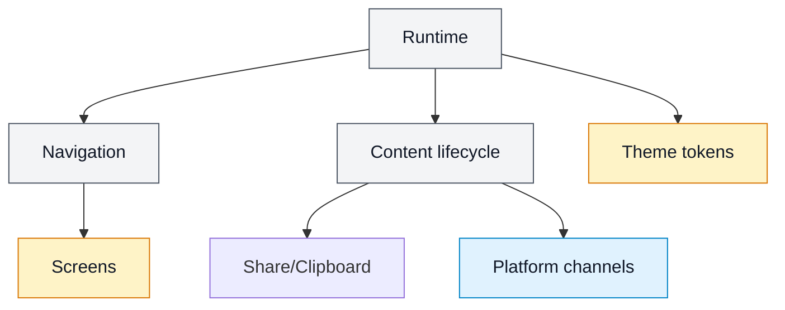

Runtime key paths: `lib/main.dart`, `lib/app.dart`, `lib/navigation/*`.

Important leaves: `main()`, `RunThruApp`, `_ContentLifecycleObserver`, `appRouter`, `cubeTransitionPage`, `wallFoldTransitionPage`, `libraryTransitionPage`.

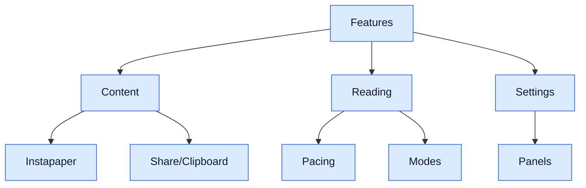

Feature key paths: `lib/features/content`, `lib/features/reading`, `lib/features/settings`.

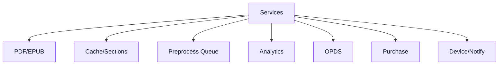

Service key paths: `lib/services/*`.

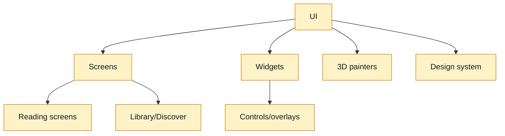

UI key paths: `lib/screens`, `lib/widgets`, `lib/three_d`, `lib/design`.

## Core Branch

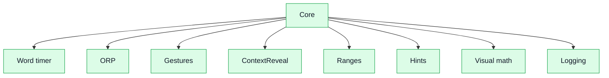

| File | Role | Code-level leaves | Related tests |
|---|---|---|---|
| `lib/core/word_timer.dart` | Reading playback state machine | `WordTimerState`, `WordTimerNotifier`, `wordTimerProvider`, warmup constants | `test/core/word_timer_*`, integration gesture/clipboard/context tests |
| `lib/core/orp.dart` | Optimal recognition point logic | `orpIndex`, `leadingPunctuationCount`, `orpIndexInOriginal` | `test/core/orp_test.dart`, `orp_condition_test.dart` |
| `lib/core/context_reveal_state.dart` | Context reveal model | `ContextRevealTier`, `ContextRevealState` | `test/core/context_reveal_test.dart` |
| `lib/core/context_reveal_notifier.dart` | Context reveal controller | `ContextRevealNotifier`, `contextRevealProvider` | `test/core/context_reveal_test.dart`, integration CR tests |
| `lib/core/gesture_classifier.dart` | Swipe classifier | `SwipeDirection`, `classifySwipe` | `test/core/gesture_threshold_test.dart` |
| `lib/core/hint_controller.dart` | Progressive hint rules | `HintInfo`, `HintController` | `test/core/hint_controller_test.dart`, `integration_test/hints_test.dart` |
| `lib/core/reading_range_resolver.dart` | Page/word range validation | `resolveAndValidateRange`, `pageForWordIndex`, `wordIndexOnPage` | `test/core/reading_range_resolver_test.dart`, `test/store/reading_range_test.dart` |
| `lib/core/sentence_resolver.dart` | Bookmark resume snapping | `resumeIndex` | `test/core/sentence_resolver*`, `test/store/reading_range_test.dart` |
| `lib/core/clipboard_document.dart` | Ephemeral pasted/shared document | `ClipboardDocument` | `test/core/clipboard_test.dart`, `integration_test/clipboard_test.dart` |
| `lib/core/clipboard_service.dart` | Clipboard text-to-document service | `ClipboardService` | `test/core/clipboard_test.dart` |
| `lib/core/dynamic_font_size.dart` | Responsive word sizing | `dynamicFontSize`, `extrusionDepth` | `test/core/dynamic_font_size_test.dart` |
| `lib/core/gradient_sweep_engine.dart` | Context reveal sweep behavior | `GradientSweepEngine` | `test/core/gradient_sweep_engine_test.dart` |
| `lib/core/room_intensity_controller.dart` | Parallax intensity policy | `RoomIntensityLevel`, `RoomIntensityController` | `test/core/room_intensity_controller_test.dart` |
| `lib/core/wcag_contrast.dart` | Contrast utilities | contrast helpers | `test/core/wcag_contrast_test.dart`, design contrast tests |
| `lib/core/word_transition.dart` | Word transition selection | `WordTransition`, `WordTransitionResult`, `selectWordTransition` | `test/core/word_transition_test.dart` |
| `lib/core/wpm_dial_state.dart` | WPM dial value object | `WpmDialState` | `test/core/wpm_dial_test.dart`, integration WPM tests |
| `lib/core/wpm_dial_notifier.dart` | WPM dial state controller | `ReadingPauseCallback`, `WpmDialNotifier`, `wpmDialProvider` | `test/core/wpm_dial_test.dart`, `integration_test/wpm_dial_test.dart` |
| `lib/core/reading_goal_presets.dart` | Goal preset definitions | `ReadingGoalConfig`, `readingGoalConfigs` | `test/widgets/reading_goal_presets_test.dart` |
| `lib/core/logger.dart` | App logging wrapper | `AppLogger`, `appLog` | Missing |

## Feature Branches

### Content Feature

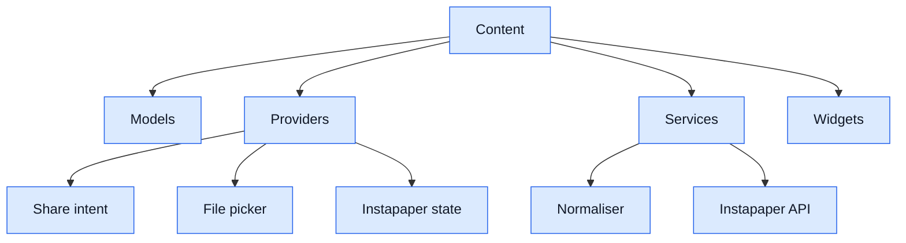

| File | Role | Code-level leaves | Related tests |
|---|---|---|---|
| `lib/features/content/models/instapaper_bookmark.dart` | Instapaper bookmark model | `InstapaperBookmark` | provider/client tests |
| `lib/features/content/models/shared_content.dart` | Cross-platform share model | `SharedContentType`, `ShareAction`, `SharedContent` | integration share/clipboard partial |
| `lib/features/content/providers/clipboard_detect_provider.dart` | Clipboard import detector | `ClipboardDetectState`, `_minWordCount`, `_maxPreviewLength`, `ClipboardDetect` | Missing direct |
| `lib/features/content/providers/file_picker_provider.dart` | PDF/EPUB/text picker and extraction state | `FilePickerState` variants, `_supportedExtensions`, `FilePickerNotifier` | Missing direct |
| `lib/features/content/providers/share_intent_provider.dart` | Platform share channel state | `ShareIntentState` variants, `_shareIntentChannel`, `ShareIntent` | Missing direct |
| `lib/features/content/providers/instapaper_auth_provider.dart` | Instapaper auth state | auth state variants, `instapaperAuthServiceProvider`, `InstapaperAuth` | `test/features/content/providers/instapaper_auth_provider_test.dart` |
| `lib/features/content/providers/instapaper_bookmarks_provider.dart` | Bookmark fetch/import/sync state | `ArticleImportState` variants, `InstapaperArticleImport`, `InstapaperBookmarks`, `instapaperSyncQueue` | `instapaper_bookmarks_provider_test.dart` |
| `lib/features/content/services/content_normaliser.dart` | Plain/Markdown/HTML to `ExtractedDocument` | `ContentType`, `_wordsPerPage`, `_isolateThreshold`, `ContentNormaliser` | `content_normaliser_test.dart` |
| `lib/features/content/services/artifact_classifier.dart` | Table/code/caption/page/reference detector | `ArtifactRegion`, `ArtifactType`, `classifyArtifacts`, private detectors | `artifact_classifier_test.dart` |
| `lib/features/content/services/instapaper_client.dart` | Instapaper xAuth/API client | token/user/config/failure/redactor/exception/client classes | `instapaper_client_test.dart` |
| `lib/features/content/services/instapaper_auth_service.dart` | Secure token persistence/auth restore | token key constants, `SecureInstapaperTokenStore`, `InstapaperSecureStorageException`, `InstapaperAuthService` | `instapaper_auth_service_test.dart` |
| `lib/features/content/services/instapaper_sync_queue.dart` | Instapaper write queue | `_kQueueKey`, `ProgressOp`, `ArchiveOp`, `InstapaperClientResolver`, `InstapaperSyncQueue` | Partial |
| `lib/features/content/widgets/clipboard_prompt.dart` | Clipboard prompt UI | `ClipboardPrompt` | Missing |
| `lib/features/content/widgets/instapaper_bookmark_list.dart` | Instapaper library UI | `InstapaperSection`, login/list/tile/error/loading/spinner widgets | `instapaper_bookmark_list_test.dart` |

Generated provider files in this feature: `clipboard_detect_provider.g.dart`, `file_picker_provider.g.dart`, `share_intent_provider.g.dart`, `instapaper_auth_provider.g.dart`, `instapaper_bookmarks_provider.g.dart`.

### Reading Feature

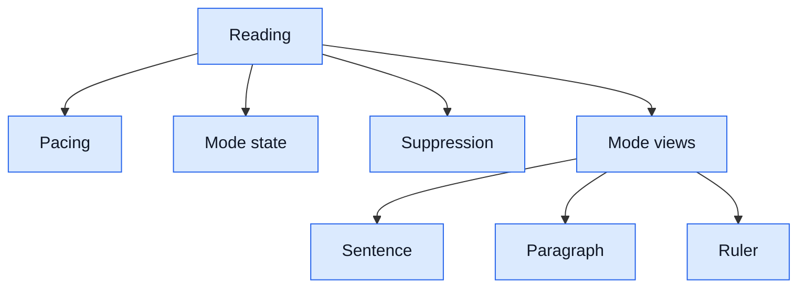

| File | Role | Code-level leaves | Related tests |
|---|---|---|---|
| `lib/features/reading/pacing/pacing_config.dart` | Tunable adaptive pacing config | clamp constants, `PacingConfig`, `defaultPacingConfig` | `test/features/reading/pacing/word_duration_test.dart`, `test/core/word_timer_pacing_test.dart` |
| `lib/features/reading/pacing/word_duration.dart` | Per-word duration algorithm | many `_k*` constants, character helpers, `readableCharacterCount`, `approximateSyllableGroups`, `startsWithLowercaseLetter`, `durationForWord` | `word_duration_test.dart`, `word_timer_pacing_test.dart` |
| `lib/features/reading/providers/reading_mode_provider.dart` | Reading mode state | `ReadingMode`, `ReadingModeNotifier` | Missing direct |
| `lib/features/reading/providers/suppression_provider.dart` | Artifact suppression state | `SuppressionState`, `SuppressionNotifier` | Missing direct |
| `lib/features/reading/widgets/mode_switcher.dart` | Reading mode selector UI | `ModeSwitcher` | Missing |
| `lib/features/reading/widgets/sentence_mode_view.dart` | Sentence mode UI | `SentenceModeView`, `_isSentenceEnd` | Missing |
| `lib/features/reading/widgets/paragraph_mode_view.dart` | Paragraph mode UI | `ParagraphModeView`, `_ParagraphModeViewState`, `_isParagraphBoundary` | Missing |
| `lib/features/reading/widgets/reading_ruler.dart` | Reading ruler overlay | `ReadingRuler` | Missing |
| `lib/features/reading/widgets/suppression_overlay.dart` | Artifact suppression overlay UI | `SuppressionOverlay`, `_RegionRow` | Missing |

Generated provider files in this feature: `reading_mode_provider.g.dart`, `suppression_provider.g.dart`.

### Settings Feature

| File | Role | Code-level leaves | Related tests |
|---|---|---|---|
| `lib/features/settings/widgets/pacing_panel.dart` | Adaptive pacing settings panel | `_sampleWords`, `PacingPanel`, `_PacingPreview`, `_PacingSlider` | pacing tests indirect |
| `lib/features/settings/widgets/spacing_controls.dart` | Letter/word spacing controls | `SpacingControls` | Missing direct |

## Services Branch

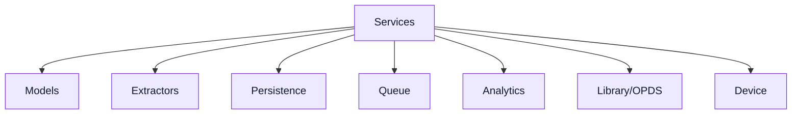

| File | Role | Code-level leaves | Related tests |
|---|---|---|---|
| `lib/services/models.dart` | Document, PDF, section, range models | `Sentence`, `ExtractedDocument`, `PdfStatus`, `PdfProgress`, `ExtractionPhase`, `PdfEntry`, `OverallProgress`, errors, `SectionData`, `DocumentManifest`, `StoreIndex`, `PageBoundary`, `ReadingRange`, `resolveRange` | `pdf_extractor_test.dart`, `reading_range*_test.dart`, `section_store_test.dart` |
| `lib/services/pdf_extractor.dart` | pdfrx PDF extraction | `_extractionTimeout`, `previewPageCount`, `PageRangeResult`, `pdfExtract`, `pdfExtractWithProgress`, isolate/page helpers | `pdf_extractor_test.dart` |
| `lib/services/epub_extractor.dart` | EPUB extraction/parser | `_epubExtractionTimeout`, `epubExtract`, preview/page/isolate/progress helpers, `_getChapters`, `_stripHtml`, `_textToSentences` | `epub_extractor_test.dart` |
| `lib/services/pdf_cache.dart` | Extracted document cache | `PdfCache` | `pdf_cache_test.dart` |
| `lib/services/section_store.dart` | Sectioned on-disk persistence | `kSectionSize`, `SectionStore`, section/manifest/index/eviction helpers | `section_store_test.dart` |
| `lib/services/section_cache.dart` | Riverpod section cache | `SectionCacheNotifier`, `sectionCacheProvider`, `storageUsageProvider` | Missing direct |
| `lib/services/cache_migration.dart` | Old cache to section store migration | `CacheMigration`, `_migrateInIsolate` | Missing |
| `lib/services/folder_scanner.dart` | PDF/EPUB folder scan | `FolderScannerService`, `pdfListProvider`, `pdfStreamProvider` | `folder_scanner_test.dart` |
| `lib/services/preprocessing_queue.dart` | Background extraction queue | `PreprocessingQueue`, queue/provider families | `preprocessing_queue*_test.dart`, `hyper_parallel_queue_test.dart` |
| `lib/services/analytics_service.dart` | SharedPreferences analytics | `AnalyticsService`, `analyticsServiceProvider` | Missing direct |
| `lib/services/opds_service.dart` | OPDS catalog/discovery | `OpdsLink`, `OpdsEntry`, `OpdsCatalog`, `OpdsService`, providers | Missing |
| `lib/services/purchase_service.dart` | Premium flag facade | `PurchaseService`, `purchaseServiceProvider` | Missing |
| `lib/services/device_capability.dart` | Device tier detection | `DeviceCapability`, `_computeCapability`, `deviceCapabilityProvider` | Missing |
| `lib/services/notification_service.dart` | Platform notification bridge | `NotificationService` | Missing |

## UI, 3D, And Design Branch

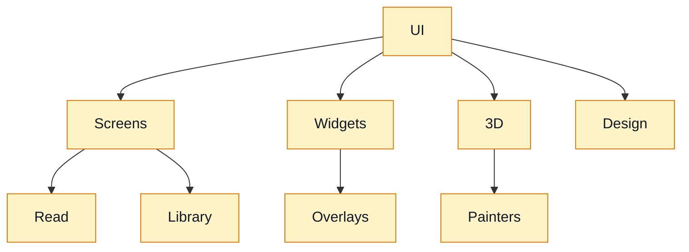

### Screens

| File | Role | Code-level leaves | Related tests |
|---|---|---|---|
| `lib/screens/analytics_screen.dart` | Reading stats screen | `AnalyticsScreen`, `_AnalyticsScreenState`, `_StatCard`, `_WpmChart` | Missing direct |
| `lib/screens/discover_screen.dart` | OPDS/free bookstore UI | `DiscoverScreen`, `_BookCard`, `_AdaptiveImage`, `_CoverPlaceholder` | Missing |
| `lib/screens/home_shell.dart` | Bottom/tab shell | `HomeShell`, `_KeepAlivePage`, `_AnalyticsTab` | Missing |
| `lib/screens/library_screen.dart` | Library/import hub | `LibraryScreen`, `_PasteButton`, `_ErrorBadge` | Missing direct |
| `lib/screens/reading_screen.dart` | Legacy reading screen | `ReadingScreen` | integration/core partial |
| `lib/screens/parallax_reading_screen.dart` | Main 3D/parallax reading screen | `ParallaxReadingScreen`, `_ParallaxReadingScreenState` | `parallax_intensity_test.dart` partial, integration gestures/CR/WPM |
| `lib/screens/range_picker_screen.dart` | Reading range selection UI | `RangePickerScreen`, `_WordSelection`, `_BottomControls`, `_SelectionLabel`, dialogs | Missing direct |
| `lib/screens/settings_screen.dart` | Settings UI | `SettingsScreen`, `_FontPicker`, `_ParallaxIntensitySelector`, `_ReadingGoalSelector` | `parallax_intensity_test.dart`, `reading_goal_presets_test.dart` partial |

### Widgets

| File | Role | Code-level leaves | Related tests |
|---|---|---|---|
| `lib/widgets/context_reveal_overlay.dart` | Context reveal overlay UI | `ContextRevealOverlay`, `_ContextRevealOverlayState` | `context_reveal_overlay_test.dart`, `adaptive_sentence_test.dart` |
| `lib/widgets/finished_range_overlay.dart` | End-of-range actions | callback typedefs, `FinishedRangeOverlay`, `_ActionButton` | Missing |
| `lib/widgets/font_size_slider.dart` | Font-size control | `FontSizeSlider` | Missing |
| `lib/widgets/hint_overlay.dart` | Hint display overlay | `HintOverlay` | integration hints partial |
| `lib/widgets/neumorphic_card.dart` | Design card primitive | `NeumorphicCard` | Missing |
| `lib/widgets/neumorphic_ripple_loading.dart` | Loading animation | `NeumorphicRippleLoading` | Missing |
| `lib/widgets/pause_fog_3d.dart` | Pause fog visual | `PauseFog3D`, `_BreathingFogPainter` | Missing |
| `lib/widgets/pdf_card_3d.dart` | 3D document card | `PdfCard3D` | Missing |
| `lib/widgets/progress_hairline_3d.dart` | Reading progress hairline | `ProgressHairline3D`, `_ProgressHairlinePainter` | Missing |
| `lib/widgets/range_confirmation_modal.dart` | Range confirmation modal | `showRangeConfirmationModal`, `_RangeConfirmationCard` | Missing |
| `lib/widgets/reading_goal_presets.dart` | Preset cards | `ReadingGoalPresets` | `reading_goal_presets_test.dart` |
| `lib/widgets/reading_range_sheet.dart` | Range input sheet | `ReadingRangeSheet`, `_InsetTextField` | Missing |
| `lib/widgets/water_ripple_painter.dart` | Ripple painter | `WaterRipplePainter` | Missing |
| `lib/widgets/word_display_3d.dart` | 3D word display wrapper | `WordDisplay3D` | Missing |
| `lib/widgets/wpm_dial_3d.dart` | WPM radial control | `WpmDial3D`, `_DialPainter` | WPM tests partial |
| `lib/widgets/wpm_slider.dart` | WPM slider control | `WpmSlider` | Missing |

### 3D And Design System

| File | Role | Code-level leaves | Related tests |
|---|---|---|---|
| `lib/three_d/back_wall_font_sizer.dart` | Back-wall text sizing | `BackWallFontSizer` | Missing |
| `lib/three_d/cube_breathe.dart` | Breathe animation mixin | `CubeBreatheMixin` | Missing |
| `lib/three_d/cube_geometry.dart` | Cube projection geometry | `CubeGeometry` | Missing |
| `lib/three_d/cube_viewport.dart` | Cube viewport widget | `CubeViewport` | Missing |
| `lib/three_d/cube_viewport_painter.dart` | Cube painter | `CubeViewportPainter` | Missing |
| `lib/three_d/glyph_measurer.dart` | Glyph bounds measurement | `GlyphPosition`, `GlyphMeasurer` | ORP condition partial |
| `lib/three_d/off_axis_projection.dart` | Room projection math | `Point3D`, `RoomConfig`, `projectOffAxis` | Missing |
| `lib/three_d/parallax_room.dart` | Parallax scene widget | `ParallaxRoom` | parallax screen partial |
| `lib/three_d/parallax_room_painter.dart` | Room painter | `ParallaxRoomPainter` | Missing |
| `lib/three_d/parallax_word_painter.dart` | Parallax word painter | `ParallaxWordPainter`, `_GlyphBox` | Missing |
| `lib/three_d/text_painter_pool.dart` | TextPainter reuse | `TextPainterPool` | ORP condition partial |
| `lib/three_d/word_painter.dart` | ORP-aware word painter | `WordPainter` | `orp_condition_test.dart` partial |
| `lib/design/design.dart` | Design barrel export | exports design modules | used broadly |
| `lib/design/animations.dart` | Motion tokens/curves | `RunThruAnimations`, `SubtleBounceIn` | Missing |
| `lib/design/animations_3d.dart` | 3D motion tokens | `RunThruAnimations3D` | Missing |
| `lib/design/decorations.dart` | Surfaces/shadows | `RunThruSurface`, `RunThruShadowSize`, `RunThruDecorations` | Missing |
| `lib/design/gesture_tokens.dart` | Gesture constants | constants | Missing |
| `lib/design/materials.dart` | Material visual recipes | `RunThruMaterials`, `MaterialParams` | Missing |
| `lib/design/reduced_motion.dart` | Accessibility motion check | `isReducedMotion` | Missing |
| `lib/design/timing_tokens.dart` | Timing constants | constants | Missing |
| `lib/design/tokens.dart` | Color/theme extension | `RunThruTokens` | contrast tests |
| `lib/design/typography.dart` | Text styles/font choices | `RunThruTypography`, `FontChoice` | Missing |
| `lib/design/typography_3d.dart` | 3D text config | `Typography3DConfig` | Missing |

## State Branch

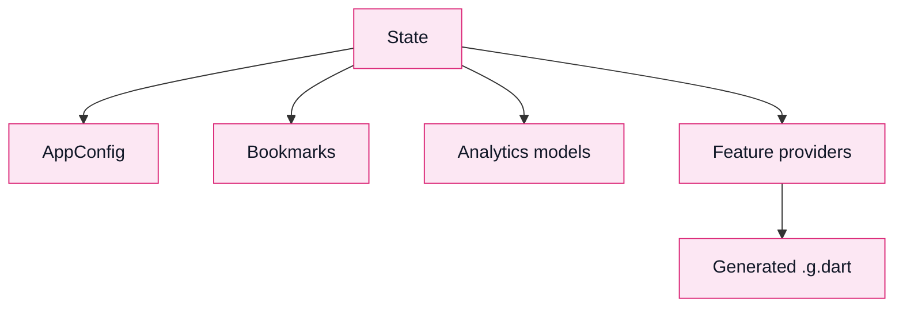

| File | Role | Code-level leaves | Related tests |
|---|---|---|---|
| `lib/store/models.dart` | Persistent app config models | `ParallaxIntensity`, `ReadingGoalPreset`, `OrpCondition`, `BookmarkData`, `AppConfig` | `test/store/config_test.dart`, reading range tests |
| `lib/store/config.dart` | SharedPreferences config notifier | `_configKey`, `ConfigNotifier`, `configProvider` | `test/store/config_test.dart` partial |
| `lib/store/analytics_models.dart` | Analytics value objects | `ReadingSession`, `DailyWpm`, `ReadingStats` | Missing direct |
| `lib/hooks/bookmark_notifier.dart` | Active bookmark state | `BookmarkNotifier`, `bookmarkProvider` | integration bookmark partial |

## Runtime Flows

### Startup

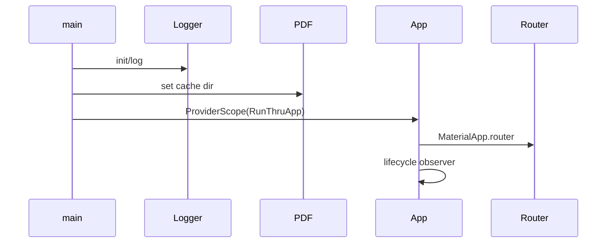

Trigger: process launch.

Main modules: `main.dart`, `app.dart`, `app_router.dart`, `logger.dart`.

Failure points: cache directory, uncaught Flutter/platform errors.

Related tests: missing direct startup test.

### Share / Clipboard Import

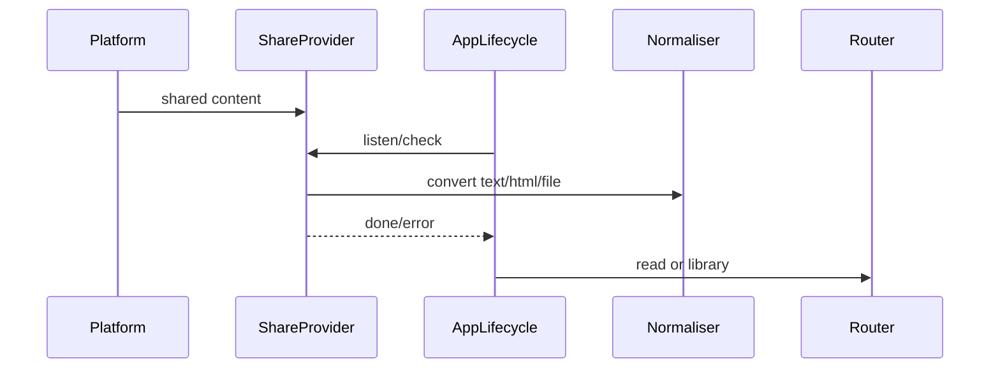

Trigger: Android intent, iOS share extension, clipboard resume check.

Main modules: native MainActivity/ShareViewController, `share_intent_provider.dart`, `clipboard_detect_provider.dart`, `content_normaliser.dart`, `app.dart`.

Failure points: unsupported content, platform channel unavailable, file copy failure, normalisation failure.

Related tests: clipboard integration strong; share provider direct tests missing.

### Reading Session

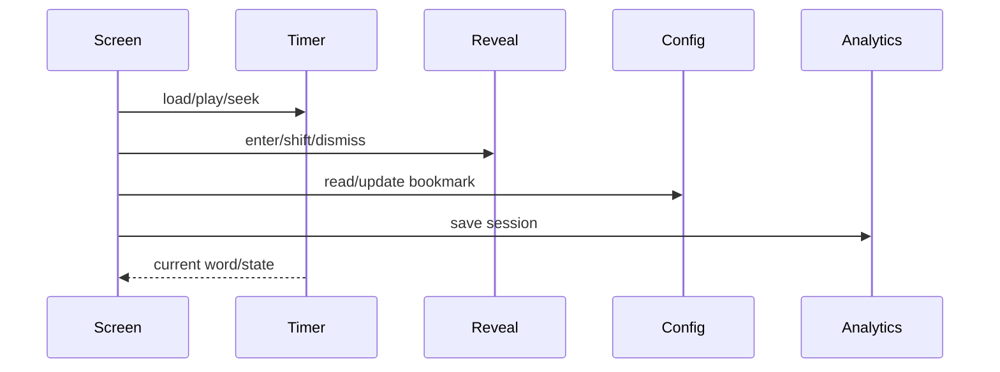

Trigger: `/read`, `/read-clipboard`, `/read-instapaper`.

Main modules: `parallax_reading_screen.dart`, `word_timer.dart`, `context_reveal_notifier.dart`, `config.dart`, `analytics_service.dart`.

Failure points: missing document, bookmark mismatch, analytics persistence failure.

Related tests: strong for timer/reveal/gestures; analytics direct tests missing.

### PDF/EPUB Extraction

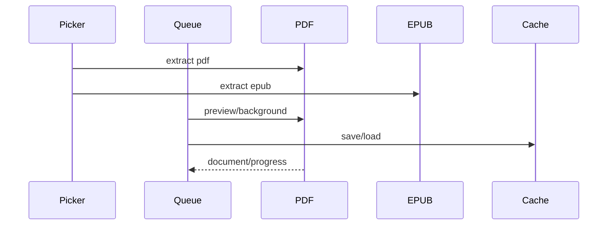

Trigger: file picker, folder scanner, preprocessing queue.

Main modules: `file_picker_provider.dart`, `pdf_extractor.dart`, `epub_extractor.dart`, `preprocessing_queue.dart`, `pdf_cache.dart`.

Failure points: corrupt files, timeout, unsupported PDFs, isolate errors.

Related tests: partial to strong for extractors/cache/queue.

### Instapaper Flow

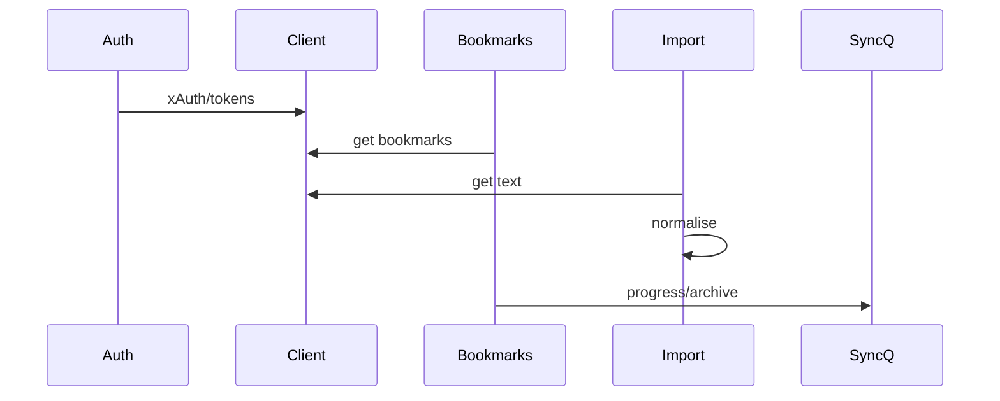

Trigger: Instapaper login, bookmark list, article import, reading progress sync.

Main modules: `instapaper_auth_provider.dart`, `instapaper_client.dart`, `instapaper_bookmarks_provider.dart`, `instapaper_sync_queue.dart`.

Failure points: credentials, token storage, API errors, premium-required article text, queued write failures.

Related tests: strong for client/auth/provider basics; queue direct coverage partial.

## Dependency Map

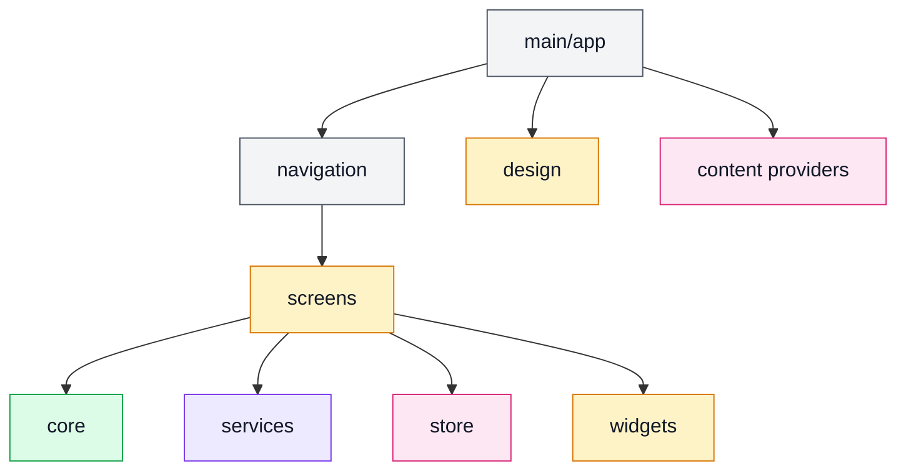

| Source Module | Depends On | Evidence | Risk |
|---|---|---|---|
| `lib/main.dart` | `pdfrx`, `path_provider`, `RunThruApp`, logger | imports | Low |
| `lib/app.dart` | router, design, content providers, platform channel | imports + method channel | Medium |
| `navigation/app_router.dart` | screens, config, purchase, design | imports/routes | Medium |
| `screens/parallax_reading_screen.dart` | core, services, store, 3D, widgets, Instapaper provider | imports | High |
| `screens/settings_screen.dart` | store/config, settings/reading widgets, design | symbols/imports | Medium |
| `features/content/providers/*` | services, models, generated Riverpod | imports/parts | Low-Medium |
| `features/reading/pacing` | store config and timer integration | imports/tests | Low |
| `services/preprocessing_queue.dart` | extractors, scanner, device, notification, cache | imports | High |
| `services/models.dart` | many service/domain models in one file | imports/users | Medium |
| `three_d/word_painter.dart` | ORP, contrast, design, store models | imports | Low |
| Android/iOS platform | Dart method channel names | native constants match Dart providers | Medium |

## Test Coverage Map

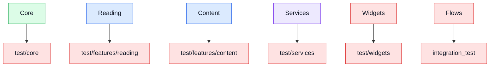

| Production Module | Test File(s) | Coverage Impression |
|---|---|---|
| ORP/core pacing/reveal/gesture/hints | `test/core/*`, `integration_test/*` | Strong |
| Adaptive word duration | `test/features/reading/pacing/word_duration_test.dart`, `test/core/word_timer_pacing_test.dart` | Strong |
| Config/bookmarks/ranges | `test/store/*`, `test/core/reading_range_resolver_test.dart` | Strong |
| Content normaliser | `test/features/content/services/content_normaliser_test.dart` | Strong |
| Instapaper client/auth/providers/widgets | `test/features/content/**` | Strong |
| PDF/EPUB/cache/queue/section store | `test/services/*` | Partial to Strong |
| Design tokens/contrast | `test/design/*`, `test/core/wcag_contrast_test.dart` | Partial |
| Screens | `test/screens/parallax_intensity_test.dart` only visible | Partial |
| UI widgets | `test/widgets/*` | Partial |
| Platform channels/share intent native code | integration coverage indirect | Partial |
| Analytics service/screen | no direct test found | Missing |
| OPDS/discover | no direct test found | Missing |
| Purchase service | no direct test found | Missing |
| Debug probes | no direct test found | Missing |

## Generated / Do-Not-Edit Files

| File path | Generator/source | Why not edit manually | Regeneration command |
|---|---|---|---|
| `lib/features/content/providers/*.g.dart` | `riverpod_generator` from `part` files | Provider hashes/types are generated | `dart run build_runner build --delete-conflicting-outputs` |
| `lib/features/reading/providers/*.g.dart` | `riverpod_generator` | Same | same |
| `android/app/src/main/java/io/flutter/plugins/GeneratedPluginRegistrant.java` | Flutter tooling | Plugin registration generated | Flutter build/pub get |
| `ios/Runner/GeneratedPluginRegistrant.h/.m` | Flutter tooling | Plugin registration generated | Flutter build/pub get |
| `macos/Flutter/GeneratedPluginRegistrant.swift` | Flutter tooling | Plugin registration generated | Flutter build/pub get |
| `linux/flutter/generated_plugin_registrant.*`, `generated_plugins.cmake` | Flutter tooling | Plugin registration generated | Flutter build/pub get |
| `windows/flutter/generated_plugin_registrant.*`, `generated_plugins.cmake` | Flutter tooling | Plugin registration generated | Flutter build/pub get |
| `.dart_tool/**`, `build/**`, `.flutter-plugins-dependencies` | Dart/Flutter build system | Ephemeral build/package artifacts | Flutter/Dart commands |

## Platform / Config / Docs / Assets Leaves

| Area | Paths | Type | Responsibility |
|---|---|---|---|
| Android app shell | `android/app/build.gradle`, `AndroidManifest.xml`, `MainActivity.kt`, resources | Platform code / Build config | App ID `com.runthru.app`, share intents, directory picker, file copy, shortcuts, launch assets |
| iOS app shell | `ios/Runner/*`, `ios/ShareExtension/*`, `ios/fastlane/*` | Platform code / CI-CD | Bundle `com.mgmacri.runthru`, App Group share extension, file access method channel, Fastlane |
| Linux/macOS/Windows | `linux`, `macos`, `windows` | Platform code | Flutter desktop shells; macOS still carries Speedy Boy identifiers |
| CI/CD | `.github/workflows/ci.yml`, `release-build.yml`, `codemagic.yaml`, Fastlane files | CI/CD | Analysis/tests/release build pipelines and store upload lanes |
| Build config | `pubspec.yaml`, `analysis_options.yaml`, Gradle, CMake, xcconfig, `dart_defines/development.json.example` | Build/config | Dependencies, fonts/assets, SDK/build settings |
| Scripts/tools | `scripts/*.dart`, `scripts/verify_ai_parity.sh`, `tools/mcp/repo_canonical_memory.py` | Script/tool | Backlog/reference cleanup, validation, AI parity, canonical memory MCP |
| Assets | `assets/fonts/*`, `ui-improvement-plan/*.png/pdf/md`, app icons | Asset | Fonts, app icons, UI improvement reference assets |
| Docs/specs/prompts | `doc/**`, `.github/instructions/**`, `.github/prompts/**`, `.github/agents/**` | Documentation | Roadmaps, specs, legal/store copy, infra docs, task prompts, auditor agents |

## Flat Module Index

| Level | Module | Path | Type | Responsibility | Important Leaves | Related Tests |
|---|---|---|---|---|---|---|
| Trunk | RunThru | repo root | App entrypoint | Paced reading product | `pubspec`, platform shells, `lib` | all |
| Large Branch | Runtime | `lib/main.dart`, `lib/app.dart` | App entrypoint | Boot, theme, lifecycle, router | `main`, `RunThruApp`, lifecycle observer | Missing direct |
| Large Branch | Navigation | `lib/navigation` | Navigation | go_router routes and transitions | `appRouter`, transition page builders | Missing direct |
| Large Branch | Core | `lib/core` | Core logic | Reading behavior algorithms/state | ORP, timer, CR, gestures, hints | Strong |
| Large Branch | Content Feature | `lib/features/content` | Feature | Import/share/Instapaper/content normalization | providers, normaliser, client | Strong/Partial |
| Large Branch | Reading Feature | `lib/features/reading` | Feature | Pacing modes, ruler, suppression | pacing config, duration, mode providers | Partial/Strong for pacing |
| Large Branch | Settings Feature | `lib/features/settings` | Widget/UI | Settings panels | `PacingPanel`, `SpacingControls` | Missing direct |
| Large Branch | Services | `lib/services` | Service | Extraction, persistence, analytics, OPDS, queue | extractors, queue, cache, analytics | Partial |
| Large Branch | Store | `lib/store`, `lib/hooks` | Provider/state | Config/bookmarks/analytics models | `AppConfig`, `ConfigNotifier`, `BookmarkNotifier` | Strong/Partial |
| Large Branch | Screens | `lib/screens` | Screen | App screens and shell | library, reading, settings, analytics | Partial |
| Large Branch | Widgets | `lib/widgets` | Widget/UI | Shared UI controls/overlays | CR overlay, WPM dial, range UI | Partial |
| Large Branch | 3D | `lib/three_d` | Widget/UI | 3D scene/painters/projection | painters, geometry, measuring | Partial/Missing |
| Large Branch | Design | `lib/design` | Design system | Tokens, typography, materials, animation | `RunThruTokens`, typography, decorations | Partial |
| Large Branch | Platform | `android`, `ios`, `linux`, `macos`, `windows` | Platform code | Native shells, share/file access | MainActivity, AppDelegate, ShareExtension | Partial |
| Large Branch | Tests | `test`, `integration_test` | Test / Integration test | Unit, widget, flow tests | test groups | n/a |
| Large Branch | Config/CI | `.github/workflows`, Fastlane, Gradle, CMake, `pubspec.yaml` | CI/CD / Build/config | Build/test/release configuration | workflows, lanes, app IDs | n/a |
| Large Branch | Docs/Prompts | `doc`, `.github` | Documentation | Specs, backlog, legal/store copy, prompts | backlog, privacy, launch context | n/a |
| Large Branch | Scripts/Tools | `scripts`, `tools` | Script/tool | Maintenance and MCP helpers | backlog fix/validate scripts | n/a |
| Large Branch | Assets | `assets`, app icons, UI plan assets | Asset | Fonts/icons/reference images | Bricolage/Satoshi fonts | n/a |
| Generated | Riverpod generated | `lib/features/**/*.g.dart` | Generated code | Generated provider glue | provider hashes/classes | generated |

## Architectural Observations

Strongest patterns present:

1. Riverpod state management is consistent across config, core controllers, services, and feature providers.
2. The reading domain has strong pure-core coverage: ORP, timer, gestures, context reveal, ranges, and adaptive pacing are well-tested.
3. Content ingestion is split into platform capture, Dart provider state, normalisation, extraction, and reading navigation.
4. Design tokens and typography are centralized in `lib/design`, with a barrel export used broadly.
5. Platform integrations use explicit method-channel boundaries for file access and share intents.

Possible module-boundary risks:

1. `parallax_reading_screen.dart` appears to orchestrate many domains directly: timer, reveal, analytics, Instapaper, services, config, widgets, and 3D.
2. `lib/services/models.dart` contains many unrelated-ish model families: document extraction, queue state, section storage, and reading ranges.
3. Older folders (`screens`, `widgets`, `services`, `core`) coexist with newer `features/*`, so ownership boundaries are mixed.
4. Native Android has duplicate `MainActivity.kt` paths, including a `com/speedyboy/speedy_boy` path whose package is now `com.runthru.app`.
5. OPDS/discover remains a top-level screen/service even though docs mark free bookstore removal as the next milestone.

Opportunities to make structure clearer:

1. Move feature-specific screens/widgets closer to `lib/features/{content,reading,settings}` where ownership is already emerging.
2. Split `services/models.dart` into document, queue, section-store, and reading-range model files.
3. Add direct tests for analytics, OPDS, purchase, share intent provider, and large screens.
4. Create an explicit platform-channel boundary module so `app.dart` does not directly coordinate iOS app group checks.
5. Document generated/build artifact policy in repo docs, especially `.g.dart`, plugin registrants, `.dart_tool`, and `build`.

Naming inconsistencies found:

1. Product/package is `runthru`, display copy says RunThru.
2. Android application ID is `com.runthru.app`; iOS bundle ID is intentionally `com.mgmacri.runthru`.
3. macOS config still uses `speedy_boy`, `com.speedyboy.speedyBoy`, and Speedy Boy app references.
4. Android contains a stale-looking source path `android/app/src/main/kotlin/com/speedyboy/speedy_boy/MainActivity.kt`, though its package declaration is `com.runthru.app`.
5. Docs include both RunThru and Speedy Boy spec names, reflecting the rebrand history.

## Final Compact Atlas

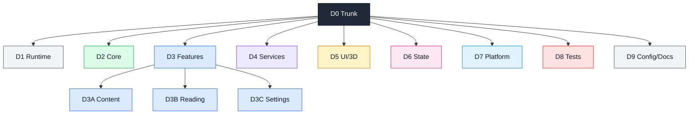
