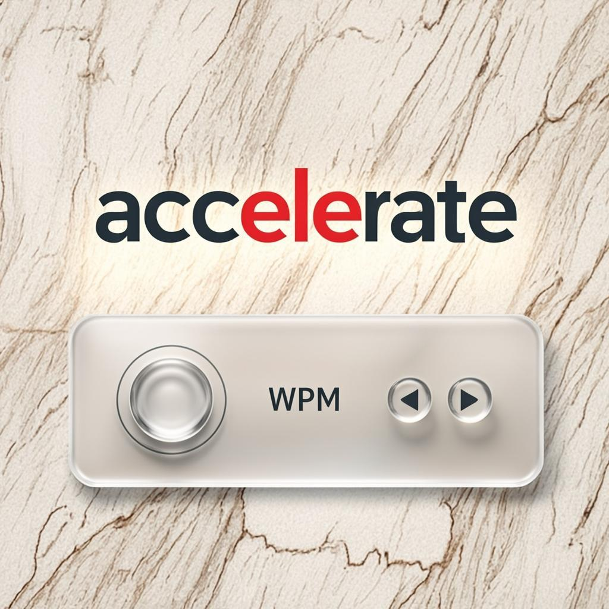
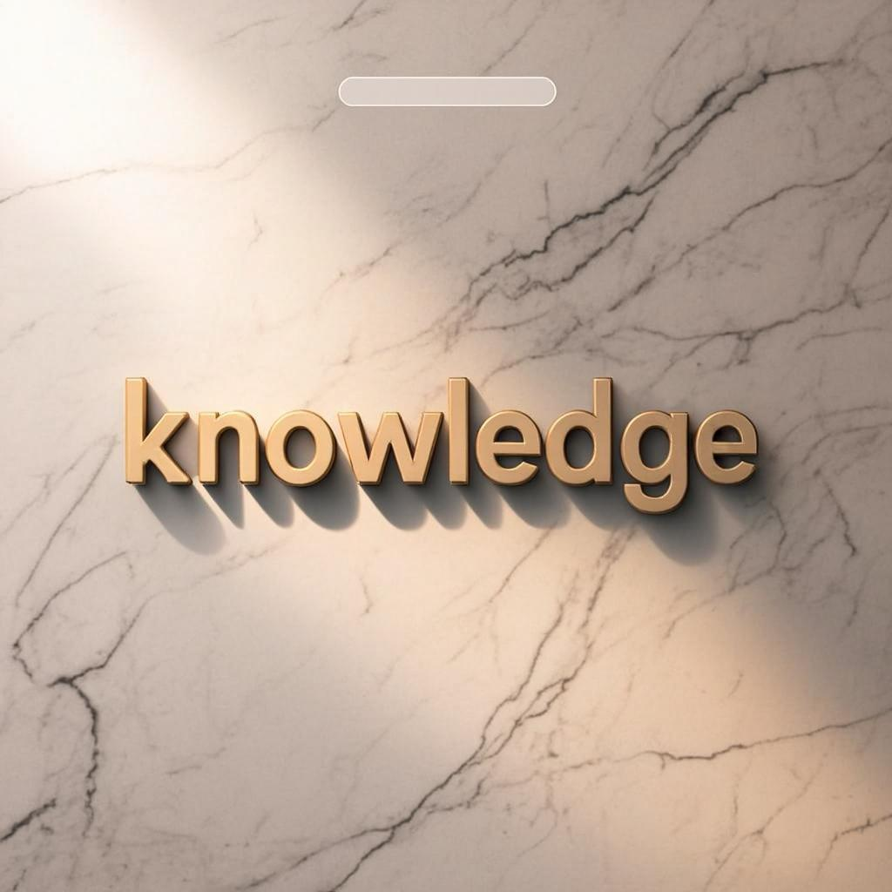
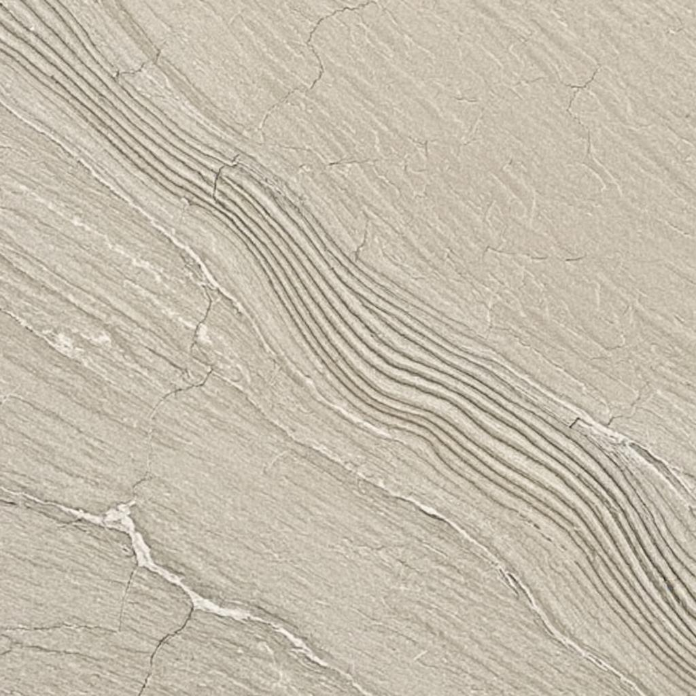
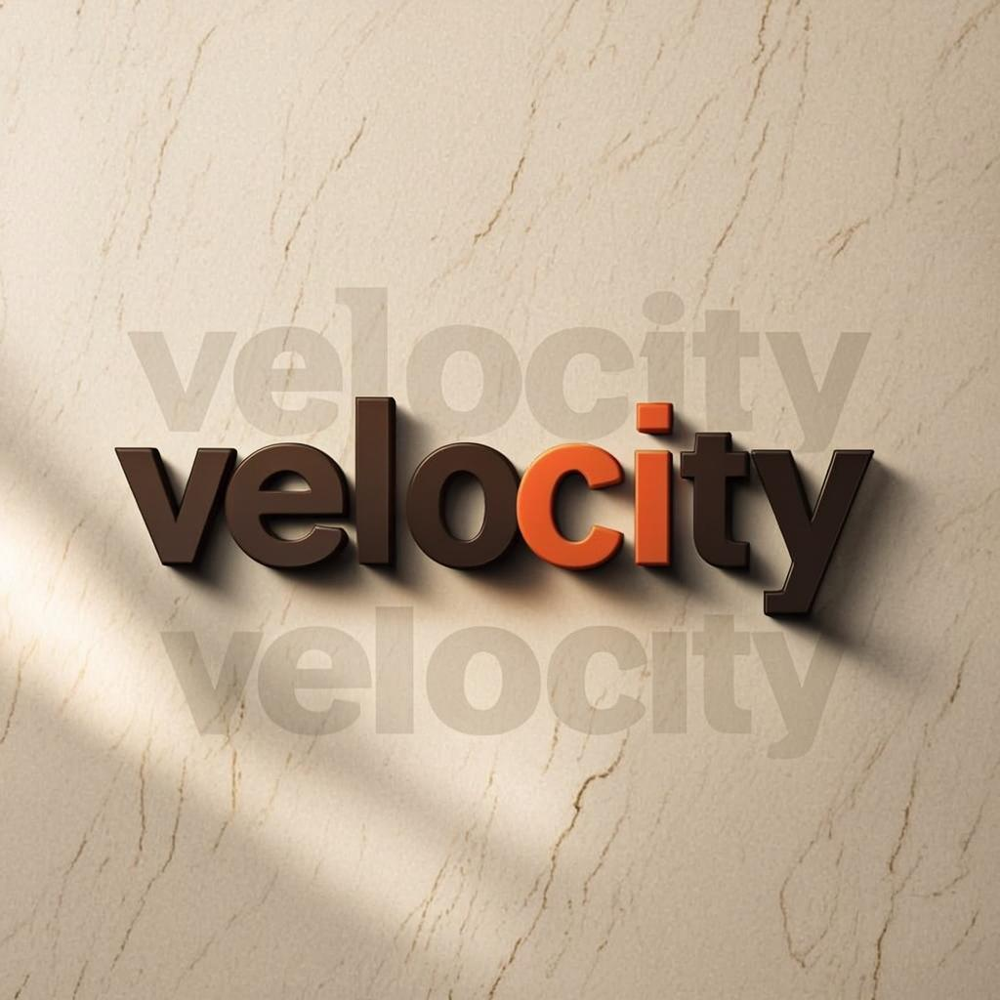

# Speedy Boy — UI Improvement Recommendations

## 4 Major Enhancements for Your 3D Neumorphic Design

---

## Executive Summary

Speedy Boy is an impressive cross-platform speed reading application featuring a sophisticated 3D neumorphic design language. The app successfully combines warm marble aesthetics with thoughtful typography and subtle depth cues. After a thorough analysis of your existing design system, I have identified four major UI improvements that will elevate the aesthetic while maintaining and enhancing the distinctive character you have already established. These recommendations are designed to complement your existing neumorphic approach, adding visual sophistication and polish that will make the app feel even more premium and intentional in its design execution.

The improvements focus on four key areas: introducing glassmorphic floating control panels for modern layered depth, enhancing ambient lighting and shadow effects for more realistic 3D perception, adding subtle animated marble vein patterns for living texture, and implementing breathing typography scale animations for dynamic visual rhythm. Each improvement is presented with detailed implementation guidance, visual mockups, and code examples that integrate seamlessly with your existing Flutter architecture.

---

## Improvement 1: Glassmorphic Floating Control Panels

### Overview

The current design uses neumorphic raised elements throughout, which creates a cohesive but somewhat flat visual hierarchy. By introducing glassmorphic floating panels for interactive controls, you can create a beautiful layered depth effect that distinguishes actionable elements from static surfaces. Glassmorphism uses frosted glass effects with background blur, subtle borders, and soft shadows to create the illusion of translucent panels floating above the content. This technique has become a signature element in modern premium interfaces, popularized by Apple's design language and widely adopted in high-end applications.

### Visual Mockup


*Figure 1: Glassmorphic floating control panel with frosted glass effect*

### Design Specifications

| Property | Value |
|----------|-------|
| Background Color | `Color(0x40FFFFFF)` — 25% white overlay |
| Backdrop Filter | `ImageFilter.blur(sigmaX: 12, sigmaY: 12)` |
| Border | 1.5px white stroke at 40% opacity |
| Border Radius | 24px for panels, 16px for inner controls |
| Shadow | `Color(0x20000000)`, offset(0, 8), blur(24) |

### Implementation Code

```dart
// glassmorphic_panel.dart
import 'dart:ui';
import 'package:flutter/material.dart';

class GlassmorphicPanel extends StatelessWidget {
  const GlassmorphicPanel({
    super.key,
    required this.child,
    this.borderRadius = 24.0,
    this.padding = const EdgeInsets.all(20),
  });

  final Widget child;
  final double borderRadius;
  final EdgeInsetsGeometry padding;

  @override
  Widget build(BuildContext context) {
    return ClipRRect(
      borderRadius: BorderRadius.circular(borderRadius),
      child: BackdropFilter(
        filter: ImageFilter.blur(sigmaX: 12, sigmaY: 12),
        child: Container(
          padding: padding,
          decoration: BoxDecoration(
            color: const Color(0x40FFFFFF), // 25% white
            borderRadius: BorderRadius.circular(borderRadius),
            border: Border.all(
              color: const Color(0x66FFFFFF), // 40% white border
              width: 1.5,
            ),
            boxShadow: [
              BoxShadow(
                color: const Color(0x20000000), // 12% black
                offset: const Offset(0, 8),
                blurRadius: 24,
              ),
            ],
          ),
          child: child,
        ),
      ),
    );
  }
}
```

### Integration with WPM Dial

The glassmorphic panel works exceptionally well when applied to the WPM dial control. Instead of the current solid neumorphic raised style, the dial can emerge as a translucent floating panel that maintains visual connection with the reading content beneath while clearly distinguishing itself as an interactive control element. The frosted glass effect creates beautiful light interactions that complement your marble aesthetic, and the subtle transparency ensures the reading environment remains visible during speed adjustments.

### Updated WpmDial3D Integration

```dart
// In your wpm_dial_3d.dart, wrap the dial content:
@override
Widget build(BuildContext context) {
  return AnimatedOpacity(
    opacity: visible ? 1.0 : 0.0,
    duration: SpeedyBoyAnimations.dialEmergeDuration,
    child: GlassmorphicPanel(
      borderRadius: 20,
      padding: const EdgeInsets.symmetric(horizontal: 24, vertical: 16),
      child: Column(
        mainAxisSize: MainAxisSize.min,
        children: [
          Text('$wpm WPM', style: SpeedyBoyTypography.badge),
          const SizedBox(height: 12),
          // Your existing slider implementation
          _buildSlider(),
        ],
      ),
    ),
  );
}
```

---

## Improvement 2: Enhanced Ambient Lighting & Depth Shadows

### Overview

Your current neumorphic shadows use a classic two-shadow approach with light and dark offsets. While this creates the characteristic raised effect, adding ambient occlusion and more sophisticated shadow layering will significantly enhance the perceived depth and realism of the 3D elements. Ambient occlusion simulates how light behaves in corners and near surfaces, creating subtle darkness where objects would naturally block ambient light. This technique, borrowed from 3D rendering and physically-based rendering pipelines, can be approximated in 2D UI to create dramatically more convincing depth illusions.

### Visual Mockup


*Figure 2: Enhanced ambient lighting with realistic depth shadows*

### Multi-Layer Shadow System

The enhanced shadow system uses five distinct shadow layers working together to create realistic depth perception. The ambient occlusion layer provides a subtle inner glow at edges, the contact shadow creates a dark pool directly beneath elements, the diffuse shadow provides the primary drop shadow with large blur, the sharp shadow creates crisp edges near the element base, and the bounce light adds a subtle colored reflection from surrounding surfaces.

### Shadow Layer Specifications

| Layer | Offset | Blur | Opacity |
|-------|--------|------|---------|
| Ambient Occlusion | (0, 2) | 8px | 15% black |
| Contact Shadow | (0, 1) | 2px | 25% black |
| Diffuse Shadow | (0, 12) | 32px | 8% black |
| Sharp Shadow | (0, 4) | 6px | 12% black |
| Bounce Light | (0, -2) | 16px | 5% warm white |

### Implementation Code

```dart
// enhanced_shadows.dart
import 'package:flutter/material.dart';
import 'package:speedy_boy/design/tokens.dart';

class EnhancedShadows {
  EnhancedShadows._();

  /// Creates a multi-layer shadow system for realistic depth.
  /// [elevation] controls the overall shadow intensity and spread.
  /// [surfaceColor] is used for the bounce light reflection.
  static List<BoxShadow> depthShadow({
    double elevation = 8.0,
    Color surfaceColor = SpeedyBoyTokens.stageBase,
  }) {
    final baseOpacity = 0.08 + (elevation * 0.01);
    
    return [
      // Ambient occlusion — subtle edge darkening
      BoxShadow(
        color: Colors.black.withOpacity(0.15),
        offset: const Offset(0, 2),
        blurRadius: 8,
        spreadRadius: -2,
      ),
      // Contact shadow — dark pool beneath
      BoxShadow(
        color: Colors.black.withOpacity(0.25),
        offset: const Offset(0, 1),
        blurRadius: 2,
        spreadRadius: 0,
      ),
      // Diffuse shadow — primary soft shadow
      BoxShadow(
        color: Colors.black.withOpacity(baseOpacity),
        offset: Offset(0, elevation * 1.5),
        blurRadius: elevation * 4,
      ),
      // Sharp shadow — crisp edge definition
      BoxShadow(
        color: Colors.black.withOpacity(0.12),
        offset: Offset(0, elevation * 0.5),
        blurRadius: elevation * 0.75,
      ),
      // Bounce light — warm reflected light
      BoxShadow(
        color: surfaceColor.withOpacity(0.50),
        offset: const Offset(0, -2),
        blurRadius: 16,
        spreadRadius: -4,
      ),
    ];
  }

  /// Inset shadow for pressed/sunken states
  static List<BoxShadow> insetShadow({
    double depth = 4.0,
    Color surfaceColor = SpeedyBoyTokens.stageBase,
  }) {
    return [
      // Inner dark edge
      BoxShadow(
        color: Colors.black.withOpacity(0.20),
        offset: Offset(0, depth * 0.25),
        blurRadius: depth,
        spreadRadius: -depth * 0.5,
      ),
      // Inner light edge (top)
      BoxShadow(
        color: SpeedyBoyTokens.stageLightShadow.withOpacity(0.40),
        offset: Offset(0, -depth * 0.25),
        blurRadius: depth,
        spreadRadius: -depth * 0.5,
      ),
    ];
  }
}
```

### Updated Decorations Integration

```dart
// Add to your decorations.dart
static BoxDecoration enhancedRaisedDecoration(
  SpeedyBoySurface surface, {
  double elevation = 8.0,
  double borderRadius = 16,
}) {
  final Color baseColor;
  final Color surfaceColor;

  switch (surface) {
    case SpeedyBoySurface.stage:
      baseColor = SpeedyBoyTokens.stageBase;
      surfaceColor = SpeedyBoyTokens.stageBase;
    case SpeedyBoySurface.shell:
      baseColor = SpeedyBoyTokens.shellBase;
      surfaceColor = SpeedyBoyTokens.shellBase;
  }

  return BoxDecoration(
    color: baseColor,
    borderRadius: BorderRadius.circular(borderRadius),
    boxShadow: EnhancedShadows.depthShadow(
      elevation: elevation,
      surfaceColor: surfaceColor,
    ),
  );
}
```

---

## Improvement 3: Animated Marble Vein Patterns

### Overview

Your marble box interior already uses warm Carrara-inspired colors, but adding subtle animated vein patterns will bring the surface to life. These organic flowing lines, characteristic of real marble, create visual interest without distracting from the reading content. The animation is extremely subtle — veins slowly shift and flow over long periods (30-60 seconds), creating a living texture that users perceive subconsciously. This technique mirrors how natural marble appears to change character as light moves across its surface throughout the day.

### Visual Mockup


*Figure 3: Animated marble vein texture with organic flowing patterns*

### Technical Approach

The animated veins are implemented using a CustomPainter that draws bezier curves influenced by simplex noise. The noise provides organic, non-repeating patterns that feel natural rather than algorithmic. Multiple vein layers with different opacities and movement speeds create depth and complexity. The animation progresses very slowly, with veins drifting just 0.5-1 pixel per second, making the movement nearly imperceptible during normal use but noticeable when returning to the app after looking away.

### Implementation Code

```dart
// marble_veins_painter.dart
import 'dart:math';
import 'package:flutter/material.dart';
import 'package:speedy_boy/design/tokens.dart';

/// Simplex noise implementation for organic vein patterns.
/// Uses gradient noise for smooth, natural-looking curves.
class SimplexNoise {
  SimplexNoise([int? seed]) {
    final random = seed != null ? Random(seed) : Random();
    _perm = List.generate(512, (i) => random.nextInt(256));
  }

  late final List<int> _perm;

  static const List<List<double>> _grad2 = [
    [1, 1], [-1, 1], [1, -1], [-1, -1],
    [1, 0], [-1, 0], [0, 1], [0, -1],
  ];

  double noise2D(double x, double y) {
    const F2 = 0.5 * (sqrt(3.0) - 1.0);
    const G2 = (3.0 - sqrt(3.0)) / 6.0;

    final s = (x + y) * F2;
    final i = (x + s).floor();
    final j = (y + s).floor();

    final t = (i + j) * G2;
    final X0 = i - t;
    final Y0 = j - t;
    final x0 = x - X0;
    final y0 = y - Y0;

    int i1, j1;
    if (x0 > y0) {
      i1 = 1; j1 = 0;
    } else {
      i1 = 0; j1 = 1;
    }

    final x1 = x0 - i1 + G2;
    final y1 = y0 - j1 + G2;
    final x2 = x0 - 1.0 + 2.0 * G2;
    final y2 = y0 - 1.0 + 2.0 * G2;

    final ii = i & 255;
    final jj = j & 255;

    double n0 = 0, n1 = 0, n2 = 0;

    var t0 = 0.5 - x0 * x0 - y0 * y0;
    if (t0 >= 0) {
      t0 *= t0;
      final gi0 = _perm[(ii + _perm[jj & 255]) & 255] % 8;
      n0 = t0 * t0 * (_grad2[gi0][0] * x0 + _grad2[gi0][1] * y0);
    }

    var t1 = 0.5 - x1 * x1 - y1 * y1;
    if (t1 >= 0) {
      t1 *= t1;
      final gi1 = _perm[(ii + i1 + _perm[(jj + j1) & 255]) & 255] % 8;
      n1 = t1 * t1 * (_grad2[gi1][0] * x1 + _grad2[gi1][1] * y1);
    }

    var t2 = 0.5 - x2 * x2 - y2 * y2;
    if (t2 >= 0) {
      t2 *= t2;
      final gi2 = _perm[(ii + 1 + _perm[(jj + 1) & 255]) & 255] % 8;
      n2 = t2 * t2 * (_grad2[gi2][0] * x2 + _grad2[gi2][1] * y2);
    }

    return 70.0 * (n0 + n1 + n2);
  }
}

/// Animated marble vein painter for living texture effect.
class MarbleVeinsPainter extends CustomPainter {
  MarbleVeinsPainter({
    required this.animation,
    this.veinColor = SpeedyBoyTokens.marbleVeinPrimary,
    this.secondaryVeinColor = SpeedyBoyTokens.marbleVeinSecondary,
    this.veinCount = 6,
    this.layerCount = 3,
  }) : super(repaint: animation);

  final Animation<double> animation;
  final Color veinColor;
  final Color secondaryVeinColor;
  final int veinCount;
  final int layerCount;

  @override
  void paint(Canvas canvas, Size size) {
    // Very slow time progression for subtle movement
    final time = animation.value * 0.0001;
    
    // Draw multiple vein layers for depth
    for (var layer = 0; layer < layerCount; layer++) {
      _drawVeinLayer(canvas, size, time, layer);
    }
  }

  void _drawVeinLayer(Canvas canvas, Size size, double time, int layer) {
    final opacity = 0.02 + (layer * 0.015);
    final isPrimary = layer % 2 == 0;
    
    final paint = Paint()
      ..color = (isPrimary ? veinColor : secondaryVeinColor).withOpacity(opacity)
      ..strokeWidth = 0.3 + (layer * 0.2)
      ..style = PaintingStyle.stroke
      ..strokeCap = StrokeCap.round;

    final noise = SimplexNoise(layer * 1000); // Seeded for consistency
    final path = Path();

    for (var i = 0; i < veinCount; i++) {
      // Stagger starting Y positions across the surface
      final startY = size.height * (0.05 + (i / veinCount) * 0.9);
      
      // Random starting X offset for variety
      final startX = -10.0 - (i * 15.0) - (layer * 5.0);
      
      path.moveTo(startX, startY);

      double x = startX;
      double prevY = startY;

      while (x < size.width + 20) {
        // Noise-based Y displacement
        final noiseVal = noise.noise2D(
          x * 0.003 + time + layer * 0.5,
          startY * 0.003 + time * 0.3,
        );
        
        // Secondary noise for additional complexity
        final noise2 = noise.noise2D(
          x * 0.008 + time * 0.5,
          startY * 0.008,
        );

        final y = startY + (noiseVal * 50) + (noise2 * 20);
        
        // Smooth curve to next point
        final controlY = (prevY + y) / 2 + noise2 * 10;
        path.quadraticBezierTo(x - 2, controlY, x, y);
        
        prevY = y;
        x += 3;
      }
    }

    canvas.drawPath(path, paint);
  }

  @override
  bool shouldRepaint(covariant MarbleVeinsPainter oldDelegate) => true;
}

/// Widget wrapper for the animated marble veins.
class AnimatedMarbleVeins extends StatefulWidget {
  const AnimatedMarbleVeins({
    super.key,
    this.veinColor = SpeedyBoyTokens.marbleVeinPrimary,
    this.secondaryVeinColor = SpeedyBoyTokens.marbleVeinSecondary,
  });

  final Color veinColor;
  final Color secondaryVeinColor;

  @override
  State<AnimatedMarbleVeins> createState() => _AnimatedMarbleVeinsState();
}

class _AnimatedMarbleVeinsState extends State<AnimatedMarbleVeins>
    with SingleTickerProviderStateMixin {
  late final AnimationController _controller;

  @override
  void initState() {
    super.initState();
    _controller = AnimationController(
      vsync: this,
      duration: const Duration(seconds: 60), // 60-second cycle
    )..repeat();
  }

  @override
  void dispose() {
    _controller.dispose();
    super.dispose();
  }

  @override
  Widget build(BuildContext context) {
    return CustomPaint(
      painter: MarbleVeinsPainter(
        animation: _controller,
        veinColor: widget.veinColor,
        secondaryVeinColor: widget.secondaryVeinColor,
      ),
      size: Size.infinite,
    );
  }
}
```

### Integration with ParallaxRoom

```dart
// In your parallax_room.dart, add as a background layer:
@override
Widget build(BuildContext context) {
  return Stack(
    children: [
      // Base marble background
      ColoredBox(color: SpeedyBoyTokens.roomBackground),
      
      // Animated veins layer (NEW)
      const Positioned.fill(
        child: AnimatedMarbleVeins(),
      ),
      
      // Existing room content...
      CustomPaint(
        painter: ParallaxRoomPainter(/* ... */),
        // ...
      ),
    ],
  );
}
```

---

## Improvement 4: Breathing Typography Scale Animation

### Overview

Words already have a subtle depth bounce effect in your implementation. Expanding this concept with a breathing scale animation creates a more dynamic reading rhythm that users can feel rather than explicitly see. The word subtly pulses between 0.98x and 1.02x scale on a 4-second cycle, synchronized with a depth offset that makes the word appear to breathe in and out of the screen. This micro-animation adds life to the reading experience without disrupting the core speed-reading functionality, creating a subliminal sense of organic movement that matches the natural marble aesthetic.

### Visual Mockup


*Figure 4: Breathing typography with subtle scale and depth animation*

### Animation Parameters

| Parameter | Value | Purpose |
|-----------|-------|---------|
| Breath Cycle | 4000ms | Matches human breathing rhythm |
| Scale Range | 0.98 – 1.02 | Subtle 2% variance |
| Z-Offset Range | 0 – 4px | Simulates depth breathing |
| Shadow Blur Range | 44 – 52px | Shadow softens as word moves forward |
| Easing Curve | EaseInOutSine | Smooth, natural motion |

### Implementation Code

```dart
// breathing_word_display.dart
import 'package:flutter/material.dart';
import 'package:speedy_boy/design/design.dart';
import 'package:speedy_boy/widgets/word_display_3d.dart';

/// A word display with subtle breathing animation.
/// The word gently pulses in scale and depth, creating
/// an organic "living" feel that enhances readability.
class BreathingWordDisplay extends StatefulWidget {
  const BreathingWordDisplay({
    super.key,
    required this.word,
    required this.fontSize,
    required this.anchorColor,
    this.fontFamily = 'BricolageGrotesque',
    this.enabled = true,
  });

  final String word;
  final double fontSize;
  final Color anchorColor;
  final String fontFamily;
  final bool enabled;

  @override
  State<BreathingWordDisplay> createState() => _BreathingWordDisplayState();
}

class _BreathingWordDisplayState extends State<BreathingWordDisplay>
    with SingleTickerProviderStateMixin {
  late final AnimationController _breathController;
  late final Animation<double> _scaleAnimation;
  late final Animation<double> _depthAnimation;
  late final Animation<double> _shadowBlurAnimation;
  late final Animation<double> _shadowOpacityAnimation;

  @override
  void initState() {
    super.initState();
    _initAnimations();
  }

  void _initAnimations() {
    _breathController = AnimationController(
      vsync: this,
      duration: const Duration(milliseconds: 4000),
    );

    // Scale: 0.98 to 1.02 (2% variance)
    _scaleAnimation = Tween<double>(
      begin: 0.98,
      end: 1.02,
    ).animate(
      CurvedAnimation(
        parent: _breathController,
        curve: Curves.easeInOutSine,
      ),
    );

    // Depth: 0 to 4px forward
    _depthAnimation = Tween<double>(
      begin: 0,
      end: 4,
    ).animate(
      CurvedAnimation(
        parent: _breathController,
        curve: Curves.easeInOutSine,
      ),
    );

    // Shadow blur: 44 to 52px
    _shadowBlurAnimation = Tween<double>(
      begin: SpeedyBoyMaterials.wordBounceShadowBlurMin,
      end: SpeedyBoyMaterials.wordBounceShadowBlurMax,
    ).animate(
      CurvedAnimation(
        parent: _breathController,
        curve: Curves.easeInOutSine,
      ),
    );

    // Shadow opacity: 0.252 to 0.36
    _shadowOpacityAnimation = Tween<double>(
      begin: SpeedyBoyMaterials.wordBounceShadowOpacityMin,
      end: SpeedyBoyMaterials.wordBounceShadowOpacityMax,
    ).animate(
      CurvedAnimation(
        parent: _breathController,
        curve: Curves.easeInOutSine,
      ),
    );

    // Start breathing cycle (only if enabled)
    if (widget.enabled) {
      _breathController.repeat(reverse: true);
    }
  }

  @override
  void didUpdateWidget(BreathingWordDisplay oldWidget) {
    super.didUpdateWidget(oldWidget);
    if (widget.enabled && !_breathController.isAnimating) {
      _breathController.repeat(reverse: true);
    } else if (!widget.enabled && _breathController.isAnimating) {
      _breathController.stop();
    }
  }

  @override
  void dispose() {
    _breathController.dispose();
    super.dispose();
  }

  @override
  Widget build(BuildContext context) {
    if (!widget.enabled) {
      return WordDisplay3D(
        word: widget.word,
        fontSize: widget.fontSize,
        anchorColor: widget.anchorColor,
        fontFamily: widget.fontFamily,
      );
    }

    return AnimatedBuilder(
      animation: _breathController,
      builder: (context, child) {
        final scale = _scaleAnimation.value;
        final depth = _depthAnimation.value;
        final shadowBlur = _shadowBlurAnimation.value;
        final shadowOpacity = _shadowOpacityAnimation.value;

        return Transform(
          transform: Matrix4.identity()
            ..scale(scale, scale)
            ..translate(0.0, 0.0, depth),
          alignment: Alignment.center,
          child: Container(
            decoration: BoxDecoration(
              boxShadow: [
                BoxShadow(
                  color: SpeedyBoyTokens.roomTextShadow.withOpacity(shadowOpacity),
                  blurRadius: shadowBlur,
                  offset: Offset(0, SpeedyBoyMaterials.wordBounceShadowOffsetY + depth),
                ),
              ],
            ),
            child: child,
          ),
        );
      },
      child: WordDisplay3D(
        word: widget.word,
        fontSize: widget.fontSize,
        anchorColor: widget.anchorColor,
        fontFamily: widget.fontFamily,
      ),
    );
  }
}
```

### Animation Constants (Add to materials.dart)

```dart
// Add these constants to SpeedyBoyMaterials class:

/// Breathing animation cycle duration in milliseconds.
static const int breathCycleMs = 4000;

/// Scale variance for breathing (±2%).
static const double breathScaleVariance = 0.02;

/// Depth offset range for breathing (room units).
static const double breathDepthRange = 4.0;

/// Shadow blur at minimum depth.
static const double breathShadowBlurMin = 44.0;

/// Shadow blur at maximum depth.
static const double breathShadowBlurMax = 52.0;
```

---

## Implementation Priority & Summary

### Recommended Implementation Order

1. **Glassmorphic Floating Panels** — Apply to WPM dial and pause overlay controls first. This creates immediate visual distinction for interactive elements and modernizes the control interface. *Estimated effort: 2-3 hours.*

2. **Enhanced Ambient Shadows** — Replace the current neumorphic shadow system with the multi-layer approach. This improves depth perception across all raised elements. *Estimated effort: 1-2 hours.*

3. **Breathing Typography** — Enhance the existing word depth bounce with the breathing scale animation. This adds organic rhythm to the reading experience. *Estimated effort: 2-3 hours.*

4. **Animated Marble Veins** — Add the subtle vein animation to the ParallaxRoom background. This is the most technically complex but provides long-term visual interest. *Estimated effort: 4-6 hours.*

### Design Token Additions

Add these to your `tokens.dart` for consistency:

```dart
// Glassmorphism tokens
static const Color glassBackground = Color(0x40FFFFFF);
static const Color glassBorder = Color(0x66FFFFFF);
static const Color glassShadow = Color(0x20000000);
static const double glassBlur = 12.0;
static const double glassBorderRadius = 24.0;

// Enhanced shadow tokens
static const double shadowAmbientOpacity = 0.15;
static const double shadowContactOpacity = 0.25;
static const double shadowDiffuseBaseOpacity = 0.08;
static const double shadowSharpOpacity = 0.12;
static const double shadowBounceOpacity = 0.50;

// Breathing animation tokens
static const Duration breathCycleDuration = Duration(milliseconds: 4000);
static const double breathScaleMin = 0.98;
static const double breathScaleMax = 1.02;
static const double breathDepthMax = 4.0;
```

### Conclusion

Speedy Boy already demonstrates excellent design fundamentals with its warm marble palette, thoughtful typography, and sophisticated 3D neumorphic effects. These four improvements build upon that foundation to create an even more refined and premium experience. The glassmorphic panels add modern layering, enhanced shadows create more convincing depth, animated veins bring the marble to life, and breathing typography adds organic rhythm. Together, these enhancements will make Speedy Boy stand out as a showcase of premium mobile UI design while maintaining the distinctive character that makes the app unique.

---

## Assets Included

- `improvement_1_glassmorphic_panel.png` — Visual mockup for glassmorphic panels
- `improvement_2_ambient_lighting.png` — Visual mockup for enhanced shadows
- `improvement_3_marble_veins.png` — Visual mockup for animated marble texture
- `improvement_4_breathing_typography.png` — Visual mockup for breathing animation
- `Speedy_Boy_UI_Improvements.pdf` — PDF version of this document
